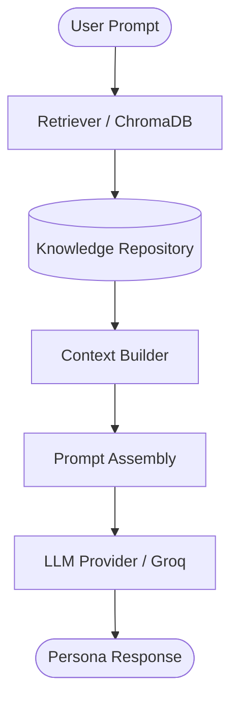
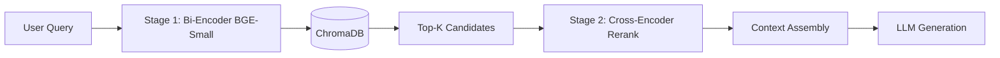
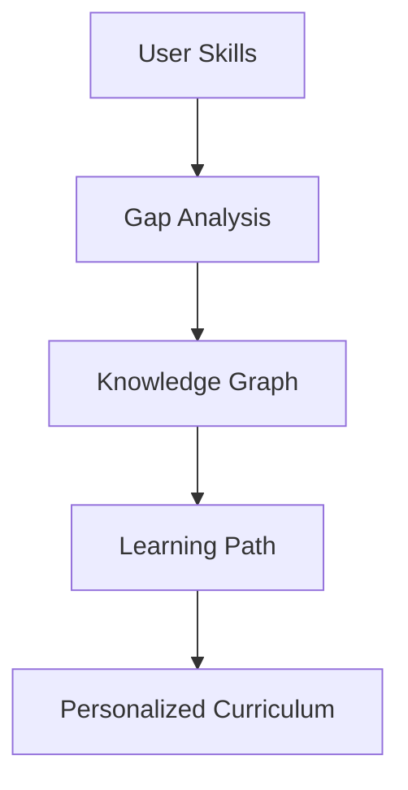

# Corpus

[](https://github.com/xvadel/Corpus)
[](https://python.org)
[](LICENSE)
[](https://github.com/xvadel/Corpus)

> **Corpus** is an AI-powered educational platform that transforms software projects and technical concepts into personalized learning experiences using Knowledge-First RAG, curriculum generation, and adaptive AI tutoring.

---

## Table of Contents

* [Project Vision](#project-vision)
* [Key Features](#key-features)
* [Architecture Diagram](#architecture-diagram)
* [Repository Structure](#repository-structure)
* [Knowledge-First Architecture](#knowledge-first-architecture)
* [Retrieval Pipeline](#retrieval-pipeline)
* [Curriculum Engine](#curriculum-engine)
* [Evaluation Framework](#evaluation-framework)
* [Installation](#installation)
* [Quick Start](#quick-start)
* [Current Development Status](#current-development-status)
* [Technology Stack](#technology-stack)
* [Documentation](#documentation)
* [Contributing](#contributing)
* [Future Work](#future-work)
* [License](#license)

---

## Project Vision

Corpus bridges the gap between deep technical mastery and high-stakes professional communication. Software developers, system architects, and AI practitioners often possess intense functional skills but struggle to pitch their projects, defend design tradeoffs, or communicate concepts using correct, authoritative terminology.

Corpus solves this problem by providing an interactive simulation sandbox. Learners converse with AI-powered persona coaches—such as Venture Capitalists, Principal Architects, and Lead PMs—who validate and score their domain vocabulary usage in real-time. By grounding the learning process in structured technical concepts first, Corpus eliminates generic conversational drift and ensures high-fidelity professional alignment.

---

## Key Features

### Knowledge Layer
* **AI Domain Ontology**: Core conceptual structures mapping Deep Learning, NLP, RAG, Fine-Tuning, and AI Engineering domains.
* **Concept Repository**: Rich, JSON-documented nodes containing precise technical definitions, applications, examples, counter-examples, and commonly confused neighbors.
* **Knowledge Graph**: A directed graph representation defining prerequisites and learning chains.

### Retrieval
* **ChromaDB Integration**: Fast local database persistence for concept retrieval.
* **Local Embeddings**: Dense vector representations generated via local `BAAI/bge-small-en-v1.5` embeddings.
* **Context Builder**: Dynamic assembly of definitions, keywords, and explicit disambiguation metadata into LLM agent prompts.
* **Semantic Search**: Precise asymmetric query matching combined with cross-encoder re-ranking.

### Learning
* **Curriculum Generation**: Prerequisite-aware learning path creation via topological sorting of concept dependencies.
* **Skill Gap Analysis**: Performance tracking using an Exponential Moving Average (EMA) scoring system to pinpoint weak nodes.
* **Personalized Learning Paths**: Dynamic, adaptive progression paths based on structural skill gaps.

### Evaluation
* **Retrieval Metrics**: Automatic tracking of Recall@K, Precision@K, nDCG, and MRR.
* **Knowledge Validation**: Graph-level sanity assertions for cycle detection, orphan nodes, and content quality.
* **Suite of Tests**: Modular integration and unit tests validating ontology and retrieval logic.

---

## Architecture Diagram

The execution flow of Corpus centers around grounding LLM generations with structured domain context pulled dynamically from the knowledge repository:



---

## Repository Structure

```
.
├── backend/                # FastAPI application & business logic
│   ├── curriculum/         # Gap analysis and learning path generation
│   ├── evaluation/         # Metrics, validation scripts, and benchmarks
│   ├── models/             # Database schemas and user state management
│   └── retrieval/          # ChromaDB retriever and cross-encoder re-ranking
├── corpus_data/            # Local data storage
│   ├── chromadb/           # Persistent vector index
│   └── concepts/           # Master JSON repository of technical concepts
├── docs/                   # API references and JSON schemas
├── frontend/               # Svelte 5 single page web application
├── infrastructure/         # Environment setup and developer config files
├── scripts/                # Database build, validation, and enrichment scripts
└── tests/                  # Pytest unit and integration test suite
```

---

## Knowledge-First Architecture

Unlike prompt-heavy educational applications that experience vocabulary drift and hallucinations, Corpus relies on a **Knowledge-First Architecture**:

1. **Ontology**: Defines explicit boundaries of the subject matter domain.
2. **Concept Repository**: Models every term with a standard JSON schema containing technical explanations, keywords, aliases, and misconceptions.
3. **Knowledge Graph**: Enforces topological order so prerequisites must be mastered before advanced topics are unlocked.
4. **Retrieval Layer**: Serves as the real-time context provider, retrieving and injecting exact technical constraints into the LLM system prompt.
5. **Curriculum Engine**: Adapts dynamically, selecting learning activities targeted at unresolved gaps in the knowledge graph.

---

## Retrieval Pipeline

The retrieval pipeline processes query strings to extract relevant concept nodes.



* **Embeddings**: Documents map term definitions, aliases, keywords, and misconceptions using `BAAI/bge-small-en-v1.5`.
* **Retrieval**: ChromaDB queries candidates using cosine similarity.
* **Context Building**: Concept definitions, applications, and misconceptions are extracted and parsed into prompt blocks.
* **Generation**: The LLM persona receives the context blocks to guide response constraints.

---

## Curriculum Engine

The curriculum engine maps out dynamic learning trajectories by calculating user skills against graph dependencies.



---

## Evaluation Framework

Corpus runs an automated evaluation framework to verify both retrieval precision and knowledge integrity.

### Retrieval Metrics
Retrieval precision is benchmarked using a 90-query dataset across Easy, Medium, and Hard tiers. The framework tracks:
* **Recall@K (K=1, 3, 5)**: Evaluates if the primary concept is retrieved.
* **Precision@K (K=5)**: Tracks the density of ground-truth concepts in the top results.
* **nDCG@5**: Measures ranking quality using graded relevance.
* **Mean Reciprocal Rank (MRR)**: Evaluates the rank position of the primary target.

### Knowledge Validation
Ontology sanity checks are run deterministically at build time:
* **Cycle Detection**: Validates that prerequisite definitions do not create circular dependencies.
* **Orphan Detection**: Assures that every concept is integrated within the ontology hierarchy.
* **Coverage & Quality Checks**: Verifies field compliance, URL validity, and minimum content densities.

### Automated Testing
* **Unit Tests**: Test core curriculum logic, skill tracking, and model serialization.
* **Integration Tests**: Verify database migration, vector embedding updates, and API routing.

---

## Installation

Ensure you have Python 3.11+ installed before proceeding.

```bash
# Clone the repository
git clone https://github.com/xvadel/Corpus.git
cd Corpus

# Create and activate a virtual environment
python -m venv venv
source venv/bin/activate  # On Windows: venv\Scripts\activate

# Install dependencies
pip install -r requirements.txt

# Setup your environment variables
cp .env.example .env
# Edit .env to populate your GROQ_API_KEY or GEMINI_API_KEY
```

---

## Quick Start

Get the system up and running locally in a few simple commands:

```bash
# 1. Build the knowledge repository and index vector embeddings
python scripts/build_knowledge_graph.py
python scripts/embed_concepts.py

# 2. Run the backend API server
uvicorn backend.main:app --port 8000
```

Once running, the documentation is interactive at [http://localhost:8000/docs](http://localhost:8000/docs).

---

## Current Development Status

*   **Knowledge Layer**
    *   ✅ Concept Ontology & Schemas
    *   ✅ Master Concept Dataset (149 concepts)
*   **Knowledge Graph**
    *   ✅ Topological sorting
    *   ✅ Build validation & Quality Checks
*   **Retrieval**
    *   ✅ ChromaDB Vector retrieval
    *   ✅ Cross-Encoder Re-ranking
*   **Evaluation**
    *   ✅ Metrics suite & automated runner
    *   ✅ Validation integration
*   **Curriculum Engine**
    *   ✅ Prerequisite resolving
    *   ✅ UserSkill tracking
*   **Specialized Agents**
    *   🚧 Conversational coaches integration
*   **Frontend**
    *   🚧 Svelte 5 dashboard
*   **Adaptive Learning**
    *   📅 Future roadmap

---

## Technology Stack

### Backend
* **FastAPI**: Core REST API framework
* **Uvicorn**: ASGI server implementation
* **Python**: Base runtime environment

### Knowledge Layer
* **ChromaDB**: Native vector database
* **SQLite**: Local relational database for user progress tracking

### AI Core
* **BAAI/bge-small-en-v1.5**: Asymmetric bi-encoder embedding model
* **BAAI/bge-reranker-base**: Cross-encoder re-ranking model
* **Groq / Gemini**: LLM orchestration backends

### Evaluation
* **pytest**: Test automation runner

---

## Documentation

* [API Reference](file:///d:/Corpus/docs/API.md): Detailed description of REST endpoints and payloads.
* [Concept Schema Definition](file:///d:/Corpus/docs/concept_schema.md): Documentation of the JSON schemas regulating technical concepts.

---

## Contributing

1. Fork the repository on GitHub.
2. Create a feature branch off the main line.
3. Commit your changes with clear messages.
4. Open a Pull Request targeting the default branch.

Ensure all local unit tests pass (`pytest tests/`) and build validation scripts run successfully (`python scripts/build_knowledge_graph.py`) before opening a PR.

---

## Future Work

* **Interactive Multi-Agent Coach Scenarios**: Let multiple agent coaches cross-examine the learner in system design panels.
* **Frontend Analytics Dashboard**: Visual progression tracking showing the user's active concept mastery across subdomains.
* **Dynamic Query Expansion**: Real-time synonym expansion based on local domain ontology mappings.

---

## License

This project is licensed under the terms of the MIT License. See the [LICENSE](LICENSE) file for details.
